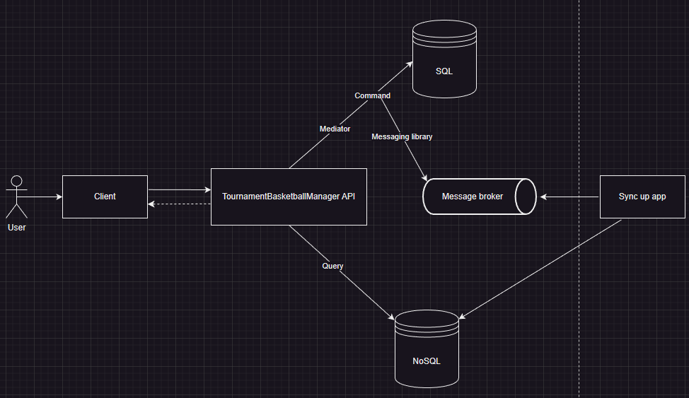

# Tournament Basketball Manager

This application allows you to match teams in a tournament based on a strategy such as a Random match, by level, by a number of players, standard match, and much more.

## System explanation

In this application, CQRS is being implemented with two databases, one for reading and the other for writing.

On the other hand, the pub/sub pattern is also implemented to publish events to a RabbitMQ queue through MassTransit, we have a background service that consumes the RabbitMQ queue, what most event consumers do is synchronize the NoSQL database.

With this approach, we have the capabilities of the SQL database with the power of EFCore for writing, and at the same time, we have the speed of a Nosql database for reading data.

In this application, we use SqlServer as the writing database and MongoDB as the reading database.